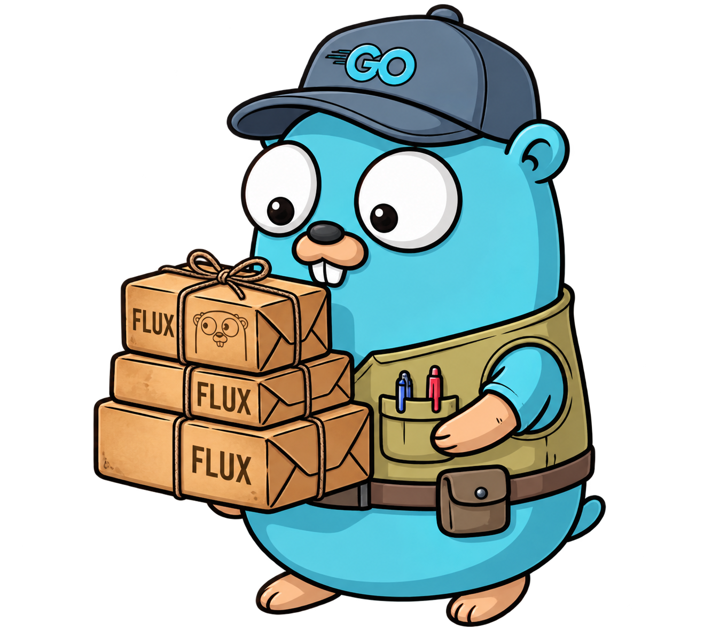

# flux

[](https://pkg.go.dev/github.com/wotek/flux)
[](https://golangci-lint.run/)
[](LICENSE)
[](https://github.com/wotek/flux/actions/workflows/build.yml)

<p align="center">
  
</p>

`flux` is a lightweight, high-performance Event Sourcing and CQRS framework for Go. Leveraging Go 1.27+ generics, it delivers fast and completely type-safe message routing. The built-in ecosystem features self-referencing aggregates, read-model projections, distributed workflows, snapshotting, and optimistic concurrency control.

## Why flux?

- **100% Reflection-Free Execution:** Fast, constant-time `O(1)` routing for commands, queries, and events using type-erased closure wrappers instead of runtime reflection.
- **Type-Safe Generic Aggregates:** Generic aggregate root (`AggregateRoot[TEvent]`) enforcing compile-time event typing and self-referencing aggregate instantiation.
- **Aggregate Snapshotting:** Memento-pattern based snapshots (`SnapshotRepository`) to accelerate loading long-lived aggregates without polluting domain logic with persistence concerns.
- **Sentinel Errors:** Programmatic error evaluation (e.g., `flux.ErrConcurrency`, `flux.ErrAggregateNotFound`) using standard Go `errors.Is()`.
- **Structured Resource Identifiers:** RFC-like URN identifiers (`urn:<org>:<env>:<service>:<account>:<type>:<id>[@version]`) stored as compact, zero-allocation strings.
- **Complete CQRS Ecosystem:**
  - **Command Bus (`command`):** In-memory single-handler routing with `command.Context`.
  - **Query Bus (`query`):** In-memory strongly typed queries returning typed results.
  - **Event Bus (`event`):** Multi-subscriber event routing with `event.Context`.
  - **Projector (`projection`):** Read-model state lifecycle and checkpoint management.
  - **Workflow & Orchestrator (`workflow`):** Multi-step process coordinators with durable Outbox command dispatching.
- **Context & Metadata Propagation:** First-class auditability preserving `Actor`, `CorrelationIdentifier`, and `CausationIdentifier` across all operations.
- **Pluggable Storage:** Built-in in-memory stores (`event/store`, `projection/store`, `workflow/store`) with clean interfaces for implementing durable event and projection databases.

## Install

Requires Go 1.27 or later:

```bash
go get github.com/wotek/flux
```

## Quick Start

This example demonstrates a simple Bank Account domain. It defines events, an aggregate root, and uses the `AggregateRepository` to save and rehydrate the state from the Event Store. The CQRS buses are then used to cleanly route commands to the aggregate.

### 1. Define Domain Events & Aggregate

```go
package main

import (
	"context"
	"fmt"

	"github.com/wotek/flux"
	eventstore "github.com/wotek/flux/event/store"
)

// Domain Event
type AccountCreated struct {
	Owner string
}

func (e AccountCreated) Name() string { return "AccountCreated" }

type MoneyDeposited struct {
	Amount int
}

func (e MoneyDeposited) Name() string { return "MoneyDeposited" }

// Aggregate
type BankAccount struct {
	flux.AggregateRoot[flux.Event]
	Owner   string
	Balance int
}

func (a *BankAccount) New(stream flux.Stream) *BankAccount {
	return NewBankAccount(stream)
}

func NewBankAccount(stream flux.Stream) *BankAccount {
	a := &BankAccount{}
	a.AggregateRoot = flux.NewAggregateRoot[flux.Event](stream, flux.NewChangeset[flux.Event](), a.apply)
	return a
}

func (a *BankAccount) apply(event flux.Event) {
	switch e := event.(type) {
	case AccountCreated:
		a.Owner = e.Owner
	case MoneyDeposited:
		a.Balance += e.Amount
	}
}

func (a *BankAccount) Create(owner string) {
	evt := AccountCreated{Owner: owner}
	a.apply(evt)
	a.Changeset().Record(evt)
}

func (a *BankAccount) Deposit(amount int) {
	evt := MoneyDeposited{Amount: amount}
	a.apply(evt)
	a.Changeset().Record(evt)
}
```

### 2. Save and Rehydrate with Repository

```go
func main() {
	ctx := context.Background()

	// In-memory event store
	eventStore := eventstore.New()
	repo := flux.NewAggregateRepository[*BankAccount, flux.Event](eventStore)

	// Create stream identifier
	id := flux.MustParseIdentifier("urn:bank:prod:core:acc123:account:main")
	stream := flux.Stream{Identifier: id}

	// Create new account
	account := NewBankAccount(stream)
	account.Create("Alice")
	account.Deposit(250)

	// Persist changes with optimistic concurrency
	if err := repo.Save(ctx, account); err != nil {
		panic(err)
	}

	// Rehydrate from event stream
	loaded, err := repo.Load(ctx, stream)
	if err != nil {
		panic(err)
	}

	fmt.Printf("Loaded Account: %s, Balance: $%d\n", loaded.Owner, loaded.Balance)
	// Output: Loaded Account: Alice, Balance: $250
}
```

### 3. Route Commands & Events

```go
import (
	"github.com/wotek/flux/command"
	"github.com/wotek/flux/event"
)

// Register a command handler
cmdBus := command.New()
command.Register(cmdBus, func(ctx command.Context, cmd CreateAccountCommand) error {
    // Command execution logic
    return nil
})

// Dispatch a command
cmdCtx := command.NewContext(context.Background(), cmdID, actor, correlationID, causationID)
if err := command.Execute(cmdCtx, cmdBus, CreateAccountCommand{Owner: "Alice"}); err != nil {
    log.Fatal(err)
}
```

## Core Concepts

### Stream

A stream represents an append-only log of events that belong to a specific entity or aggregate. It tracks the identity of the sequence.

```go
package flux

// Stream represents a sequence of events for a specific aggregate or entity.
type Stream struct {
	// Identifier is the unique identifier of the stream.
	Identifier Identifier
}
```

### Identifier

The identifier provides a unified and globally unique way to address any resource (streams, events, actors, projections, workflows) within the system.

Format: `urn:<organization>:<environment>:<service>:<account_id>:<resource_type>[:/]<resource_id>[@<version>]`

- `organization`: Top-level boundary.
- `environment`: Optional (e.g., `eu-west-1`, `production`).
- `service`: The service namespace (e.g., `auth`, `payments`, `inventory`).
- `account_id`: Customer, workspace, or org ID.
- `resource_type`: The type of resource (e.g., `user`, `stream`, `event`).
- `resource_id`: The identifier or path to the resource. Separated from `resource_type` by `:` (for simple IDs) or `/` (for paths).
- `version`: Optional annotation (prefixed with `@`) to specify a version, which is particularly useful in an event-sourced system.

```go
// Component represents a part of the Identifier.
type Component int

const (
	ComponentOrganization Component = iota
	ComponentEnvironment
	ComponentService
	ComponentAccountID
	ComponentResourceType
	ComponentResourceID
	ComponentVersion
)

// Identifier represents a globally unique resource identifier.
// It is stored as a single underlying URN string to minimize memory footprint (16 bytes)
// when passed by value across envelopes and messages.
type Identifier struct {
	urn string
}

// Component accessors extract the respective parts from the underlying URN string lazily.
func (i Identifier) Organization() string
func (i Identifier) Environment() string
func (i Identifier) Service() string
func (i Identifier) AccountID() string
func (i Identifier) ResourceType() string
func (i Identifier) ResourceID() string
func (i Identifier) Version() string // Returns string to support "1", "latest", or UUIDs

// IsEmpty returns true if the Identifier is the zero value (uninitialized or empty).
func (i Identifier) IsEmpty() bool

// String returns the canonical string representation of the Identifier.
// It consistently uses ':' to separate all components, including ResourceType
// and ResourceID, and allows ResourceID to natively contain path separators ('/').
// Empty optional components (like Environment) are represented by empty strings between colons.
// It appends '@version' if Version is not empty.
func (i Identifier) String() string

// ParseIdentifier parses a formatted URN string into an Identifier struct.
func ParseIdentifier(s string) (Identifier, error)

// MustParseIdentifier constructs an Identifier directly from a URN string,
// panicking if the format is invalid. Ideal for inline test usage.
func MustParseIdentifier(s string) Identifier

// Is checks if a specific component of the identifier matches the given value.
// E.g., id.Is(ComponentService, "payments")
func (i Identifier) Is(c Component, value string) bool
```

### Event and Envelope

In event sourcing, an **Event** represents a domain fact (something that happened), while an **Envelope** wraps that event with essential framework metadata (such as timestamps, positions, actors, and causal context).

```go
// Event represents a strongly-typed domain event payload.
// This is an interface that concrete event types (e.g., UserCreated) implement.
type Event interface {
	// Name returns the string representation of the event type.
	Name() string
}

// Envelope wraps a domain event with standard framework metadata.
type Envelope struct {
	// Identifier is the globally unique identifier of this specific event occurrence.
	// e.g., urn:myorg:prod:payments:tenant1:event/uuid-1234
	Identifier Identifier

	// Stream is the stream this event belongs to.
	Stream Stream

	// Revision is the sequence number of this event within its specific stream.
	Revision uint64

	// Position is the sequence number of this event in the Global Event Stream.
	// This is useful for iterating over events across all streams in the system.
	Position uint64

	// Event is the actual strongly-typed domain payload.
	Event Event

	// Metadata contains optional, custom headers for the event (e.g., tracing spans, feature flags).
	// To minimize heap allocations during large reads, this map should remain nil if empty.
	Metadata map[string]string

	// CreatedAt is the time the event was generated.
	CreatedAt time.Time

	// Actor represents the user, system, or service that caused this event.
	Actor Actor

	// CorrelationIdentifier ties this event to a specific command, request, or overarching transaction.
	CorrelationIdentifier Identifier

	// CausationIdentifier points to the ID of the specific event or command that directly caused this event.
	CausationIdentifier Identifier
}
```

### Actor

The **Actor** represents the entity (user, service, or system process) that initiated the state change. It carries its own `Identifier` and can be expanded in the future to carry additional authorization or contextual metadata.

```go
// Actor represents the entity that initiated a change in the system.
type Actor struct {
	// Identifier is the globally unique ID of the actor (e.g., urn:...:user/123 or urn:...:service/auth).
	Identifier Identifier

	// Additional fields like Roles or IP address can be added here if needed for auditing.
}
```

### Event Store

The **Event Store** is the append-only database of the system.

It is highly recommended that the Event Store deals exclusively with **Envelopes** rather than raw Events. The `Aggregate Repository` (which we will design later) will act as the bridge: it takes raw `Event`s emitted by your aggregates, wraps them in `Envelope`s (enriching them with the `Actor`, `CorrelationIdentifier`, etc., often pulled from the `context.Context`), and passes those Envelopes to the Event Store.

```go
// StreamIterator is a standardized iterator over a sequence of Envelopes.
// It is fully compatible with Go 1.23 iter.Seq2, allowing it to be used directly in for-range loops.
type StreamIterator iter.Seq2[Envelope, error]

const (
	// ExpectedRevisionAny instructs the EventStore to append events without checking the current stream revision.
	ExpectedRevisionAny uint64 = 1<<64 - 1 // math.MaxUint64

	// ExpectedRevisionNoStream instructs the EventStore to append only if the stream does not exist yet.
	ExpectedRevisionNoStream uint64 = 0
)

// EventStore defines the contract for persisting and retrieving events.
type EventStore interface {
	// Append adds one or more envelopes to a specific stream.
	// The `expectedRevision` is used for optimistic concurrency control (e.g.,
	// rejecting the append if the stream's current revision does not match expectedRevision).
	// Constants ExpectedRevisionAny and ExpectedRevisionNoStream can be used for special behavior.
	Append(ctx Context, stream Stream, expectedRevision uint64, envelopes []Envelope) error

	// Read retrieves a sequence of envelopes from a specific stream.
	// `fromRevision` dictates the starting sequence number (inclusive).
	// It returns a StreamIterator for efficient traversal.
	Read(ctx Context, stream Stream, fromRevision uint64) (StreamIterator, error)

	// Stream iterates over the global event stream across all aggregates.
	// This is primarily used by Projections and Workflows.
	// It returns a StreamIterator for efficient, leak-free traversal.
	Stream(ctx Context, from uint64) (StreamIterator, error)
}
```

### Aggregate

The **Aggregate** (or Aggregate Root) is the primary consistency boundary in the domain. It is responsible for enforcing business invariants. Instead of mutating database rows directly, it executes business logic and emits domain **Events** to represent state changes.

Leveraging Go Generics, the framework allows each domain aggregate to enforce strict type checks on its own specific Event types (e.g., an `OrderAggregate` only accepts `OrderEvent`s).

```go
// Changeset tracks uncommitted events generated during command execution.
// The type parameter E ensures only events belonging to this aggregate are recorded.
type Changeset[E Event] interface {
	// Record adds a new event to the changeset.
	Record(event E)

	// Clear empties the changeset (called after successful persistence).
	Clear()

	// HasChanges returns true if there are uncommitted events.
	HasChanges() bool

	// Events returns the list of uncommitted events.
	Events() []E
}

// NewChangeset provides a default, slice-backed implementation of the Changeset interface.
func NewChangeset[E Event]() Changeset[E]

// Aggregate defines the core contract for a domain aggregate.
// It leverages Go 1.27+ self-referencing constraints for reflection-free instantiation.
type Aggregate[A Aggregate[A, E], E Event] interface {
	// Identifier returns the globally unique identifier for this aggregate.
	Identifier() Identifier

	// Changeset returns the tracker for new, uncommitted events.
	Changeset() Changeset[E]

	// FromEvents replays historical events to reconstitute the aggregate's state.
	// It accepts a StreamIterator (which yields Envelopes) to allow the aggregate
	// to synchronize its internal Revision alongside applying the event payloads.
	FromEvents(events StreamIterator) error

	// New creates a new, empty instance of the aggregate.
	// This is called on a nil pointer by the framework during loading.
	New(stream Stream) A
}

// AggregateRoot is an embeddable struct providing the foundational boilerplate
// for any domain aggregate (composition over inheritance).
type AggregateRoot[E Event] struct {
	stream    Stream
	revision  uint64
	changeset Changeset[E]

	// apply is a closure/method provided by the concrete aggregate to mutate its state.
	apply func(E)
}

// NewAggregateRoot initializes the boilerplate. The concrete aggregate passes its Apply method.
// Note: Revisions are not incremented when recording new events to the changeset, only when
// replaying from the EventStore or after successful persistence.
func NewAggregateRoot[E Event](stream Stream, changeset Changeset[E], apply func(E)) AggregateRoot[E] {
	return AggregateRoot[E]{
		stream:    stream,
		changeset: changeset,
		apply:     apply,
	}
}

// Identifier returns the underlying globally unique identifier.
func (a *AggregateRoot[E]) Identifier() Identifier {
	return a.stream.Identifier
}

// Changeset returns the tracked uncommitted events.
func (a *AggregateRoot[E]) Changeset() Changeset[E] {
	return a.changeset
}

// Revision returns the aggregate's current sequence number.
func (a *AggregateRoot[E]) Revision() uint64 {
	return a.revision
}

// FromEvents iterates over the StreamIterator, type-asserts the generic Event
// into the aggregate's specific Event type E, applies it, and updates the revision.
func (a *AggregateRoot[E]) FromEvents(events StreamIterator) error {
	for env, err := range events {
		if err != nil {
			return err
		}

		// Ensure the event conforms to this aggregate's specific event type constraint.
		domainEvent, ok := env.Event.(E)
		if !ok {
			return fmt.Errorf("%w: aggregate %s cannot apply %T", ErrInvalidEvent, a.Identifier(), env.Event)
		}

		if a.apply != nil {
			a.apply(domainEvent)
		}
		// Synchronize aggregate revision with the envelope's revision
		a.revision = env.Revision
	}
	return nil
}
```

### Aggregate Repository

The **Aggregate Repository** acts as the bridge between the domain Aggregates and the framework's `EventStore`.

It is responsible for:

1. **Loading**: Fetching raw envelopes from the `EventStore` and calling `FromEvents` on the user-provided aggregate instance to reconstitute its state.
2. **Saving**: Taking the uncommitted events from the aggregate's `Changeset`, wrapping them in `Envelope`s (pulling Actor and CorrelationIdentifier from the Context), appending them to the `EventStore`, and finally clearing the changeset.

```go
// AggregateRepository provides the standard unit-of-work interface for Event Sourced aggregates.
type AggregateRepository[A Aggregate[A, E], E Event] struct {
	// internal fields
}

// NewAggregateRepository creates a new repository for a specific Aggregate and Event type.
func NewAggregateRepository[A Aggregate[A, E], E Event](eventStore EventStore) *AggregateRepository[A, E]

// Load fetches events for the provided aggregate Stream from the Event Store and replays them.
// It leverages the Aggregate interface's New(stream Stream) method to instantiate the object internally.
// If the stream does not exist, it returns an error wrapping [ErrAggregateNotFound].
func (r *AggregateRepository[A, E]) Load(ctx Context, stream Stream) (A, error)

// Save persists the uncommitted events from the aggregate's Changeset to the Event Store.
// It is responsible for generating globally unique Identifiers for each new event occurrence,
// wrapping the raw domain Event payloads into Envelopes (pulling Actor and CorrelationIdentifier from the Context),
// and calling the EventStore.Append method with the aggregate's current revision for concurrency control.
// After successful persistence, it calls Clear() on the Changeset.
func (r *AggregateRepository[A, E]) Save(ctx Context, aggregate A) error
```

### Snapshotting

For long-lived aggregates that accumulate thousands of events over time, replaying the entire stream from revision 0 during a `Load` operation can become a performance bottleneck.

The framework provides aggregate snapshotting using the **Memento Pattern** to prevent polluting domain aggregates with infrastructure serialization concerns. An aggregate exports and restores its state via a strongly typed DTO (`S`).

#### Interfaces & Structs

```go
// Snapshotable defines how an aggregate exposes and restores its internal state using the Memento pattern.
type Snapshotable[S any] interface {
	Snapshot() S
	With(state S)
}

// Snapshot represents a captured point-in-time state of an Aggregate at a specific revision.
type Snapshot[S any] struct {
	State    S
	Revision uint64
}

// SnapshotStore defines the persistence contract for storing and retrieving aggregate snapshots.
type SnapshotStore[S any] interface {
	Load(ctx context.Context, stream Stream) (Snapshot[S], error)
	Save(ctx context.Context, stream Stream, snap Snapshot[S]) error
}

// SnapshotSchedule determines if an aggregate should be snapshotted based on its current state.
type SnapshotSchedule[A any] interface {
	Test(aggregate A) bool
}

// Schedule is an alias for [SnapshotSchedule].
type Schedule[A any] = SnapshotSchedule[A]

// SnapshotScheduleFunc is a function adapter that implements [SnapshotSchedule].
type SnapshotScheduleFunc[A any] func(aggregate A) bool

// Test calls the underlying function to test if a snapshot should be taken.
func (f SnapshotScheduleFunc[A]) Test(aggregate A) bool {
	return f(aggregate)
}

// SnapshotAggregate ensures the aggregate type implements both [Aggregate] and [Snapshotable].
type SnapshotAggregate[A Aggregate[A, E], E Event, S any] interface {
	Aggregate[A, E]
	Snapshotable[S]
}

// SnapshotRepository wraps an [AggregateRepository] to provide snapshot-assisted loading
// and scheduled snapshot saving.
type SnapshotRepository[A SnapshotAggregate[A, E, S], E Event, S any] struct {
	// unexported fields
}

// NewSnapshotRepository constructs a new [SnapshotRepository].
func NewSnapshotRepository[A SnapshotAggregate[A, E, S], E Event, S any](
	base *AggregateRepository[A, E],
	store SnapshotStore[S],
	schedule SnapshotSchedule[A],
	eventStore EventStore,
) *SnapshotRepository[A, E, S]

// Load fetches an aggregate from a snapshot (if available) and catches up with any trailing events.
// If no snapshot exists, it falls back to replaying all events from the beginning.
func (r *SnapshotRepository[A, E, S]) Load(ctx Context, stream Stream) (A, error)

// Save persists uncommitted events to the underlying event store and evaluates the snapshot schedule.
// If the schedule matches, a new snapshot is captured and persisted.
func (r *SnapshotRepository[A, E, S]) Save(ctx Context, aggregate A) error

// Every returns a [SnapshotSchedule] that triggers every n events.
func Every[A Aggregate[A, E], E Event](n uint64) SnapshotSchedule[A]
```

## Testing

Run unit tests and race detection:

```bash
go test -v -race ./...
```

## Reference Applications from examples/

The `example/` directory contains complete, runnable reference applications demonstrating how to use `flux` in production-like environments.

- **[Bank Account Quick Start](example/bank/README.md):** Minimal standalone reference implementation demonstrating aggregates, repositories, and command routing from the Quick Start guide.
- **[Todo Reference Application](example/todo/README.md):** A complete CQRS and Event Sourced reference implementation with domain events, co-located handlers, TUI client, and read-model projections.
- **[E-Commerce](example/e-commerce/README.md):** Advanced reference application showcasing bounded contexts, complex cross-aggregate projections, and long-running distributed workflows (compensating transactions).

## API

### Sentinel Errors

The framework exports standard sentinel errors to allow consumers to programmatically evaluate failure reasons using `errors.Is()`.

```go
var (
	// ErrAggregateNotFound is returned when an aggregate cannot be loaded from the EventStore or SnapshotStore.
	ErrAggregateNotFound = errors.New("aggregate not found")

	// ErrConcurrency is returned by an EventStore when an optimistic concurrency check fails.
	ErrConcurrency = errors.New("optimistic concurrency check failed")

	// ErrInvalidEvent is returned when an aggregate's FromEvents encounters an event type it cannot apply.
	ErrInvalidEvent = errors.New("invalid event type for aggregate")

	// ErrNoHandler is returned by Command and Query buses when no handler is registered for a given type.
	ErrNoHandler = errors.New("no handler registered")
)
```

### Message Bus / Dispatcher

The framework utilizes three distinct buses to implement CQRS (Command Query Responsibility Segregation) and Event-Driven architecture:

1. **Command Bus**: Routes a Command to exactly _one_ Command Handler.
2. **Query Bus**: Routes a Query to exactly _one_ Query Handler, returning a strongly-typed result.
3. **Event Bus**: Routes an Event to _zero or more_ Event Handlers (used for projections, side-effects, and workflows).

By leveraging Go Generics and package-level execution functions, we achieve 100% type safety on inputs and outputs without forcing Commands or Queries to implement marker interfaces.

The Dispatcher buses (`command`, `query`, and `event`) natively support middleware chaining (interceptors). This allows developers to inject cross-cutting concerns like global telemetry, authentication barriers, database transaction management, and OpenTelemetry spans without polluting domain logic.

Middlewares are registered using the `Use()` method:

```go
bus.Use(func(ctx command.Context, cmd any, next func(command.Context, any) error) error {
    ctx.Logger().Info("Executing command", "type", fmt.Sprintf("%T", cmd))
    err := next(ctx, cmd)
    return err
})
```

Middlewares execute in the order they are provided, chaining perfectly down to the underlying handler.

### Contexts

To bridge the gap between keeping domain payloads lean and providing explicit, type-safe metadata (avoiding "magic" context keys), the framework defines custom contexts.

Because they embed `context.Context`, they can be passed directly into standard library functions, database queries, and the Event Store.

> [!WARNING]
> Wrapping a typed context (e.g., using `context.WithTimeout`) returns a standard `context.Context`, stripping the typed methods. Handlers should extract needed metadata early if they plan to wrap the context for downstream calls.

#### Interfaces

```go
// package flux
// Context is the base typed context for the framework, providing guaranteed
// access to metadata for any operation.
type Context interface {
	context.Context
	Actor() Actor
	CorrelationIdentifier() Identifier
	CausationIdentifier() Identifier
	Logger() *slog.Logger
}

// package command
// Context extends the base Context for command execution.
type Context interface {
	flux.Context
	CommandIdentifier() flux.Identifier
}

// package query
// Context extends the base Context for read-only query operations.
type Context interface {
	flux.Context
	QueryIdentifier() flux.Identifier
}

// package event
// Context provides strongly-typed access to the Envelope metadata
// while keeping the event payload clean.
type Context interface {
	flux.Context
	EventIdentifier() flux.Identifier
	Stream() flux.Stream
	Revision() uint64
	Position() uint64
	Metadata() map[string]string
}

// package projection
// Context extends event.Context. It acts as a distinct type boundary
// guaranteeing that the context is bound to the projection's active database transaction.
type Context interface {
	event.Context
}

// package workflow
// Context extends event.Context, giving workflow handlers the ability to dispatch commands.
type Context interface {
	event.Context

	// dispatch is unexported. It is used internally by the framework's
	// strongly-typed EnqueueCommand helper to safely queue commands.
	dispatch(cmd any)

	// QueuedCommands returns all commands enqueued during the event handling.
	QueuedCommands() []any
}

// package workflow
// EnqueueCommand safely queues a strongly-typed command to be dispatched.
// To prevent "dual-write" anomalies (where a command fires but the workflow state fails to save),
// the framework guarantees that enqueued commands are ONLY sent to the CommandBus
// after the Orchestrator successfully persists the Workflow's updated state.
func EnqueueCommand[C any](ctx Context, cmd C)
```

#### Constructors

```go
// package flux
func NewContext(parent context.Context, actor Actor, correlationId Identifier, causationId Identifier) Context

// package command
func NewContext(parent context.Context, cmdId flux.Identifier, actor flux.Actor, correlationId flux.Identifier, causationId flux.Identifier) Context

// package query
func NewContext(parent context.Context, queryId flux.Identifier, actor flux.Actor, correlationId flux.Identifier, causationId flux.Identifier) Context

// package event
func NewContext(parent context.Context, env flux.Envelope) Context

// package projection
func NewContext(parent event.Context) Context

// package workflow
func NewContext(parent event.Context) Context
```

#### Contextual Logging & Distributed Tracing

The base `flux.Context` inherently integrates with the standard Go `log/slog` package. Calling `ctx.Logger()` returns an `*slog.Logger` instance that is automatically pre-configured with contextual tracing attributes:

- `actor`: The URN of the user or system executing the operation.
- `correlation_id`: The transaction boundary identifier.
- `causation_id`: The ID of the preceding message (useful for async event handlers and workflows).

By leveraging `ctx.Logger().Info(...)`, developers achieve zero-effort distributed tracing across the entire command-event-query lifecycle.

### Handlers

Handlers define the interface for processing Commands, Queries, and Events. They receive their respective strongly-typed contexts.

```go
// package command
// Handler executes business logic for a specific command.
type Handler[C any] interface {
	Handle(ctx Context, cmd C) error
}

// package query
// Handler executes read-only logic and returns a strongly-typed result.
type Handler[Q any, R any] interface {
	Handle(ctx Context, query Q) (R, error)
}

// package event
// Handler reacts to domain events that were successfully persisted to the Event Store.
type Handler[E flux.Event] interface {
	Handle(ctx Context, event E) error
}
```

### Command Bus

```go
// package command

// Bus manages command routing.
// It can optionally be configured with a distributed transport (like NATS or SQS) for async execution.
type Bus struct {
	// internal fields
}

// New creates a new command Bus.
func New() *Bus

// Register wires a functional handler for a specific command type.
func Register[C any](bus *Bus, handler func(ctx Context, cmd C) error)

// RegisterHandler wires a command to its handler.
// Panics if a handler is already registered for type C.
func RegisterHandler[C any](bus *Bus, handler Handler[C])

// Execute routes the command to its registered handler synchronously.
// This is the default as most CQRS commands (e.g. from an HTTP request)
// require immediate feedback on domain invariants.
func Execute[C any](ctx Context, bus *Bus, cmd C) error

// ExecuteAsync performs a "fire-and-forget" dispatch.
// If the bus has no distributed transport configured, it executes the handler
// in a background goroutine (safely detaching the context). If a transport is
// configured, it serializes and enqueues the command for background workers.
func ExecuteAsync[C any](ctx Context, bus *Bus, cmd C) error
```

> [!TIP]
> The framework intentionally avoids "batch" or "multi-command" dispatch methods. Because `command.Execute` is completely thread-safe, developers can use native Go primitives (like `sync.WaitGroup` or `golang.org/x/sync/errgroup`) to execute commands sequentially or in parallel. Long-running orchestrations should use Workflows instead of sequential scripts.

### Query Bus

```go
// package query

// Bus manages query routing.
type Bus struct {
	// internal fields
}

// New creates a new QueryBus.
func New() *Bus

// Register wires a functional handler for a specific query type.
func Register[Q any, R any](bus *Bus, handler func(ctx Context, query Q) (R, error))

// RegisterHandler wires a query to its handler and expected return type.
// Panics if a handler is already registered for type Q.
func RegisterHandler[Q any, R any](bus *Bus, handler Handler[Q, R])

// Execute routes the query to its registered handler, returning the strongly-typed result R.
func Execute[Q any, R any](ctx Context, bus *Bus, query Q) (R, error)
```

### Event Bus

The Event Bus is typically invoked by a background worker tailing the `EventStore`'s global stream.

```go
// package event

// Bus manages routing domain events to multiple subscribers.
type Bus struct {
	// internal fields
}

// New creates a new EventBus.
func New() *Bus

// Register wires a functional subscriber to a specific event type.
func Register[E flux.Event](bus *Bus, handler func(ctx Context, event E) error)

// RegisterHandler adds a subscriber to a specific event type.
func RegisterHandler[E flux.Event](bus *Bus, handler Handler[E])

// PublishEnvelope routes an Envelope to all registered subscribers.
func PublishEnvelope(ctx Context, bus *Bus, env flux.Envelope) error

// Publish wraps a domain event in an Envelope and routes it to all registered subscribers.
// Mostly used for internal framework events or testing.
func Publish[E flux.Event](ctx Context, bus *Bus, event E) error
```

### Projections

In CQRS, **Projections** (or Read Models) listen to the global event stream and build state optimized for read operations.

A critical requirement of any projection is tracking its progress using a cursor (the global `Position` of the last processed event) so it can resume safely after a restart. The state mutation and the cursor update must be transactional to prevent data anomalies.

```go
// package projection

// Store defines the contract for persisting both the read-model data and its cursor.
// It abstracts the transactional boundaries of the underlying database (e.g., PostgreSQL, MongoDB).
type Store interface {
	// GetPosition retrieves the last successfully processed global position for the projection.
	GetPosition(ctx context.Context, id flux.Identifier) (uint64, error)

	// Update runs a database transaction. It provides the framework with a transactional
	// context and executes the `mutate` closure (which contains the user's read-model logic).
	// If the closure succeeds, the framework commits the transaction, atomically saving the
	// read-model changes AND the new envelope.Position.
	Update(ctx context.Context, id flux.Identifier, env flux.Envelope, mutate func(txCtx context.Context) error) error
}

// Projector is the background worker that powers a Projection.
// It tails the EventStore.Stream() starting from the Store.GetPosition().
type Projector struct {
	// internal fields
}

// New creates a new Projector instance.
func New(id flux.Identifier, eventStore flux.EventStore, projStore Store) *Projector

// RegisterHandler wires a specific event type to the projection's logic.
// It leverages the same generic type-safety as the EventBus, but executes the handler
// strictly within the Store's Update() transaction boundary.
func RegisterHandler[E flux.Event](p *Projector, handler func(ctx Context, event E) error)

// Start begins tailing the EventStore in the background until the context is canceled.
func (p *Projector) Start(ctx context.Context) error
```

#### Cross-Domain Projections

Because the `Projector` tails the **Global Event Stream** (via `EventStore.Stream`) rather than individual aggregate streams, it natively supports listening to events across entirely different domains. You can simply register multiple event types to the same projector, and it will route them sequentially in the exact deterministic order they occurred system-wide.

```go
// Example: A single dashboard projection handling cross-domain events
proj := projection.New(dashboardID, eventStore, sqlStore)

projection.RegisterHandler(proj, func(ctx projection.Context, e OrderCreated) error { /* ... */ })
projection.RegisterHandler(proj, func(ctx projection.Context, e UserRegistered) error { /* ... */ })
```

#### Example: Building and Querying a Read Model

The framework intentionally does **not** provide a `ReadModel` interface. Read models are simply native database tables (or MongoDB documents, etc.). You use the `Projector` to write to them, and the `QueryBus` to read from them.

The most idiomatic way to pass dependencies (like database connections) into your handlers is by using struct methods:

```go
// 1. The native Read Model struct (returned to your API)
type UserStats struct {
	Email       string
	TotalOrders int
}

// 2. The Projection Handlers (Writing the read model)
type UserStatsProjection struct {
	db *sql.DB // Dependency injection!
}

func (p *UserStatsProjection) HandleRegistered(ctx projection.Context, e UserRegistered) error {
	// The context guarantees we are inside the Store's transaction
	_, err := p.db.ExecContext(ctx, "INSERT INTO user_stats (id, email, total_orders) VALUES ($1, $2, 0)", e.ID, e.Email)
	return err
}

// 3. The Query Handler (Reading the read model)
type UserStatsQueryHandler struct {
	db *sql.DB
}

type GetUserStats struct { ID string }

func (h *UserStatsQueryHandler) Handle(ctx query.Context, q GetUserStats) (UserStats, error) {
	var stats UserStats
	err := h.db.QueryRowContext(ctx, "SELECT email, total_orders FROM user_stats WHERE id = $1", q.ID).
		Scan(&stats.Email, &stats.TotalOrders)
	return stats, err
}

// 4. Wiring it up
userStatsProj := &UserStatsProjection{db: myDatabase}
proj := projection.New(dashboardID, eventStore, sqlStore)
projection.RegisterHandler(proj, userStatsProj.HandleRegistered)

queryBus := query.New()
query.RegisterHandler(queryBus, &UserStatsQueryHandler{db: myDatabase})
```

#### Temporal Integration (Optional Path)

Because the framework strictly decouples **Routing** from **Execution**, you are not forced to use the default `Projector` or `ProjectionStore`. If you prefer to run Projections as durable [Temporal Workflows](https://temporal.io/), the framework provides the perfect hooks to bridge the gap.

The most robust and operational-friendly architecture combines **EventStore Tailing** with **EventBus Signals**.

```go
func DashboardProjectionWorkflow(ctx workflow.Context, lastRevision int) error {
	wakeupChan := workflow.GetSignalChannel(ctx, "WakeUpSignal")

	// 1. Loop and tail the EventStore via a Temporal Activity
	for {
		var batch []flux.Envelope
		var nextRevision int

		err := workflow.ExecuteActivity(ctx, FetchEventsActivity, lastRevision).Get(ctx, &batch)
		if err != nil {
			return err
		}

		// 2. Execute projection logic (e.g., SQL INSERT) transactionally in an Activity
		for _, env := range batch {
			err := workflow.ExecuteActivity(ctx, UpdateDashboardActivity, env).Get(ctx, nil)
			if err != nil {
				return err // Temporal will automatically retry the activity!
			}
			lastRevision = env.GlobalPosition
		}

		// 3. Prevent workflow history limits by continuing as new
		if workflow.GetInfo(ctx).GetCurrentHistoryLength() > 10000 {
			return workflow.NewContinueAsNewError(ctx, DashboardProjectionWorkflow, lastRevision)
		}

		// 4. If we caught up, block until the EventBus signals us there is new data.
		// This prevents hammering the database with continuous polling.
		if len(batch) == 0 {
			selector := workflow.NewSelector(ctx)

			// Wait for live event signal
			selector.AddReceive(wakeupChan, func(c workflow.ReceiveChannel, more bool) {
				c.Receive(ctx, nil) // Consume signal
			})

			// Fallback polling to ensure nothing is missed
			timerCtx, cancelTimer := workflow.WithCancel(ctx)
			selector.AddFuture(workflow.NewTimer(timerCtx, 1 * time.Minute), func(f workflow.Future) {})

			selector.Select(ctx)
			cancelTimer()
		}
	}
}
```

By owning the read-loop inside a Temporal Workflow using this hybrid approach, you unlock massive operational superpowers:

- **Efficient Catch-up & Replay:** To completely rebuild a projection, you simply `Terminate` the current Temporal Workflow execution, truncate your read-model SQL table, and start a new execution with `lastRevision = 0`. It will bypass the signal blocks (because `len(batch) > 0`) and rapidly loop through the entire event store history.
- **Efficient Live Operation:** Once the workflow catches up to the live stream (`len(batch) == 0`), it stops polling. The framework's standard `EventBus` is then configured to fire a `WakeUpSignal` to the Temporal workflow whenever a new event occurs, instantly unblocking it to read the new data.
- **Pausing & Resuming:** You can easily add a `PauseSignal` branch to the selector. When received, the workflow blocks and halts polling until a `ResumeSignal` is received. This is absolutely invaluable during read-model database migrations or schema updates.
- **Adding Projections to a Live System:** When you build a new feature that requires a brand new read model, you simply deploy the new Temporal Workflow code and start it at `revision = 0`. It will catch up to the live system seamlessly without requiring any downtime, deployments, or modifications to the core event stream.

### Workflows

A **Workflow** coordinates long-running business processes that span multiple aggregates. It listens to domain events, maintains internal state to track the progress of the workflow, and dispatches commands to other aggregates.

```go
// package workflow

// Workflow defines the contract for a process manager.
// It leverages Go 1.27+ self-referencing constraints for reflection-free instantiation.
type Workflow[W Workflow[W]] interface {
	// Identifier returns the globally unique ID of this workflow instance.
	// This is typically derived from the CorrelationIdentifier of the triggering event.
	Identifier() flux.Identifier

	// New creates a new, empty instance of the workflow.
	// This is called on a nil pointer by the Orchestrator during loading.
	New() W

	// Clone creates an isolated copy of the workflow instance to guarantee
	// that in-flight mutations in handlers do not leak into the store before Save.
	Clone() W
}

// Store defines how the internal state of a workflow is persisted between events.
type Store[W Workflow[W]] interface {
	// Load retrieves the workflow state. The store is responsible for instantiating it.
	Load(ctx context.Context, id flux.Identifier) (W, error)

	// Save persists the workflow's state alongside any enqueued commands within the SAME
	// database transaction. A separate relay process polls these commands and forwards
	// them to the CommandBus to achieve At-Least-Once (Outbox) delivery.
	Save(ctx context.Context, workflow W, commands []any) error
}

// CheckpointStore persists and retrieves the stream position reached by an orchestrator.
type CheckpointStore interface {
	GetPosition(ctx context.Context, id flux.Identifier) (uint64, error)
	SetPosition(ctx context.Context, id flux.Identifier, position uint64) error
}

// Orchestrator is the background worker that listens to the global event stream
// and routes events to the appropriate workflow instances.
type Orchestrator struct {
	// internal fields
}

// NewOrchestrator creates a new orchestrator engine with position checkpointing.
func NewOrchestrator(id flux.Identifier, eventStore flux.EventStore, checkpoint CheckpointStore) *Orchestrator

// RegisterHandler wires a specific event type to a workflow's state transition.
// The store is provided here so the orchestrator knows how to load/save this specific workflow type.
func RegisterHandler[W Workflow[W], E flux.Event](o *Orchestrator, store Store[W], handler func(ctx Context, workflow W, event E) error)
```

#### Usage Example: The Outbox Pattern

To prevent "dual-write" anomalies (where a command executes successfully but the Workflow fails to save its state, causing the command to be duplicated on retry), Workflows do **not** execute commands synchronously. Instead, they use `EnqueueCommand`. The framework handles the transactional safety automatically.

```go
// Example: A Workflow handling user onboarding
workflow.RegisterHandler(orchestrator, myWorkflowStore, func(ctx workflow.Context, w *OnboardingWorkflow, e UserRegistered) error {
	// 1. Update internal workflow state based on the event
	w.ID = ctx.CorrelationIdentifier()
	w.Status = "AWAITING_WELCOME_EMAIL"

	// 2. Safely queue a strongly-typed command
	// The Orchestrator will automatically persist the workflow state and this command
	// together into the database (via Store.Save) to guarantee At-Least-Once delivery.
	workflow.EnqueueCommand(ctx, SendWelcomeEmail{Email: e.Email})

	return nil // Returning nil triggers the transactional save of state + commands
})
```

#### Temporal Integration (Optional Path)

Because Workflows are inherently stateful and frequently require timers (e.g., "if payment isn't confirmed in 10 minutes, issue a refund command"), they are notoriously complex to build in vanilla databases. This makes them the absolute **perfect candidate** for Temporal workflows.

If you choose to run your Workflows in Temporal, you do not need the `WorkflowStore` or `Orchestrator`.
Instead:

1. You use the `EventBus` to push events into a Temporal Workflow (just like Projections).
2. The Temporal Workflow _is_ your Workflow. It natively maintains its own local state variables.
3. When the Workflow wants to dispatch a command, it executes a Temporal `Activity` that calls `command.ExecuteAsync(ctx, bus, myCmd)`.

## License

Distributed under the [MIT License](LICENSE).
