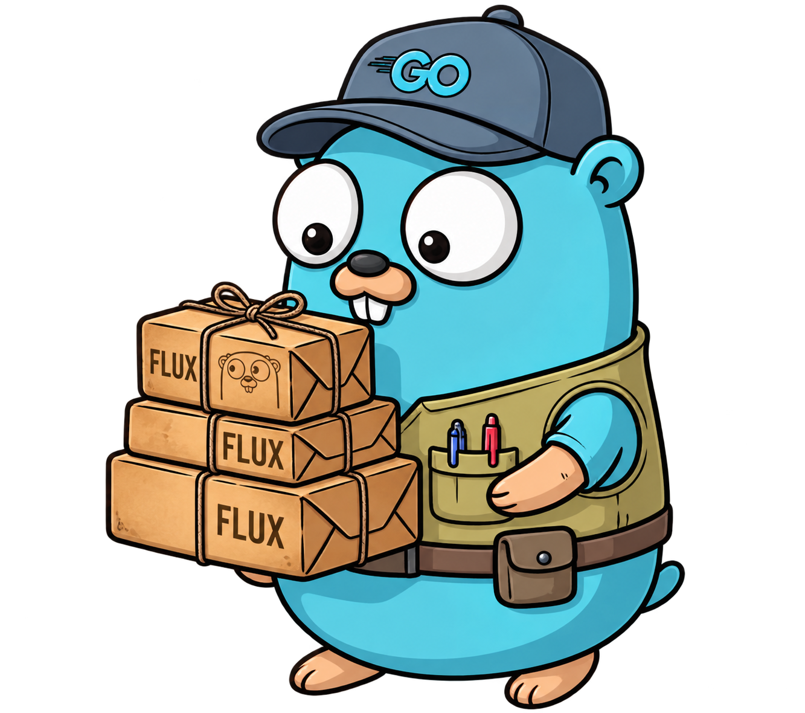

# flux

[](https://pkg.go.dev/github.com/wotek/flux)
[](https://github.com/wotek/flux/actions/workflows/build.yml)
[](LICENSE)

<p align="center">
  
</p>

`flux` is a lightweight, high-performance Event Sourcing and CQRS framework for Go. It uses Go 1.27+ generics for reflection-free, type-safe aggregates, commands, queries, projections, and workflows.

## Documentation

Full guides, tutorials, and API reference live on the docs site:

**[https://flux.keylight.io/](https://flux.keylight.io/)**

Also see the [Go package reference](https://pkg.go.dev/github.com/wotek/flux).

## Why flux?

Most Go event-sourcing libraries lean on `reflect` for handler routing, event decoding, and aggregate hydration. That costs runtime performance and gives up compile-time safety.

`flux` takes a different path:

- **Generics instead of reflection** — command, query, and event routing use type-safe registration and constant-time dispatch.
- **Domain stays pure** — aggregates and events carry no `json` tags, no store types, and no framework persistence APIs in domain methods.
- **Serialization at the edge** — DTOs, codecs, and type registries live in infrastructure packages, not in the core domain.
- **Bring your own backend** — in-memory stores for tests; MySQL and Redis drivers for production; clean interfaces if you need another store.
- **Optional Temporal** — native projectors and orchestrators for embedded workloads; Temporal remains a parallel runtime for durable timers and distributed workflows, not a hard dependency.
- **Optional OpenTelemetry** — core stays vendor-agnostic; use [`flux-opentelemetry`](https://github.com/wotek/flux-opentelemetry) (`fluxotel`) when you want spans and metrics.

## Design principles

1. **Reflection-free** — if it compiles, handler and aggregate wiring is sound.
2. **Framework decoupling** — business logic does not import databases, brokers, or serializers.
3. **Domain purity** — events and aggregates stay free of infrastructure concerns.
4. **Pluggable persistence** — swap in-memory for durable backends without rewriting domain code.
5. **At-least-once delivery** — stream consumers and outbox relays may redeliver; handlers must be idempotent.
6. **Vendor-neutral telemetry** — portable `Instrumentation` on contexts and envelopes; OTel lives in a separate module.

## Features

- Type-safe aggregates with changesets, optimistic concurrency, and optional snapshotting
- Command, query, and event buses with middleware
- Continuous projectors with checkpointed global-stream cursors
- Workflow orchestrators with transactional outbox command dispatch
- Structured URN identifiers and typed contexts (`Actor`, correlation, causation, instrumentation)
- Built-in in-memory stores; MySQL and Redis backends for events, snapshots, and checkpoints
- Sentinel errors for `errors.Is` (`ErrConcurrency`, `ErrAggregateNotFound`, and others)

## Install

> [!NOTE]
> Requires Go 1.27 or later.

```bash
go get github.com/wotek/flux
```

## Quick usage

Persist and rehydrate an aggregate with the in-memory event store:

```go
package main

import (
	"context"
	"fmt"

	"github.com/wotek/flux"
	eventstore "github.com/wotek/flux/event/store"
)

type AccountCreated struct{ Owner string }

func (e AccountCreated) Name() string { return "AccountCreated" }

type BankAccount struct {
	flux.AggregateRoot[flux.Event]
	Owner   string
	Balance int
}

func (a *BankAccount) New(stream flux.Stream) *BankAccount {
	return NewBankAccount(stream)
}

func NewBankAccount(stream flux.Stream) *BankAccount {
	a := &BankAccount{}
	a.AggregateRoot = flux.NewAggregateRoot[flux.Event](stream, flux.NewChangeset[flux.Event](), a.apply)
	return a
}

func (a *BankAccount) apply(event flux.Event) {
	switch e := event.(type) {
	case AccountCreated:
		a.Owner = e.Owner
	}
}

func (a *BankAccount) Create(owner string) {
	evt := AccountCreated{Owner: owner}
	a.apply(evt)
	a.Changeset().Record(evt)
}

func main() {
	ctx := context.Background()
	repo := flux.NewAggregateRepository[*BankAccount, flux.Event](eventstore.New())

	stream := flux.Stream{
		Identifier: flux.MustParseIdentifier("urn:bank:prod:core:acc123:account:main"),
	}

	account := NewBankAccount(stream)
	account.Create("Alice")
	if err := repo.Save(ctx, account); err != nil {
		panic(err)
	}

	loaded, err := repo.Load(ctx, stream)
	if err != nil {
		panic(err)
	}
	fmt.Println(loaded.Owner) // Alice
}
```

For a runnable version with a command bus, see [`example/bank`](example/bank). Continue with the [Quick Start](https://flux.keylight.io/getting-started/quick-start) and [Tutorial](https://flux.keylight.io/tutorial/01-project-setup) on the docs site.

## Examples

| Example | Description |
| --- | --- |
| [Bank Account](example/bank) | Minimal aggregates, repository, and command routing |
| [Todo](example/todo) | Full CQRS slice: commands, projections, and a TUI client |
| [E-Commerce](example/e-commerce) | Bounded contexts, cross-aggregate projections, and payment workflows |

Docs pages: [Bank](https://flux.keylight.io/examples/bank) · [Todo](https://flux.keylight.io/examples/todo) · [E-Commerce](https://flux.keylight.io/examples/e-commerce)

## Guides

- [Events & Envelopes](https://flux.keylight.io/guide/events)
- [Aggregates & Changesets](https://flux.keylight.io/guide/aggregates)
- [Repositories & Snapshots](https://flux.keylight.io/guide/repositories)
- [Command, Query, and Event Buses](https://flux.keylight.io/guide/buses)
- [Projections](https://flux.keylight.io/guide/projections)
- [Workflows & Temporal](https://flux.keylight.io/guide/workflows)
- [Instrumentation & Observability](https://flux.keylight.io/guide/instrumentation)
- [Structured Identifiers](https://flux.keylight.io/guide/identifiers)
- [Serialization & Codecs](https://flux.keylight.io/guide/serialization)
- [Backends: In-Memory](https://flux.keylight.io/backends/in-memory) · [MySQL](https://flux.keylight.io/backends/mysql) · [Redis](https://flux.keylight.io/backends/redis)

## License

Distributed under the [MIT License](LICENSE).
