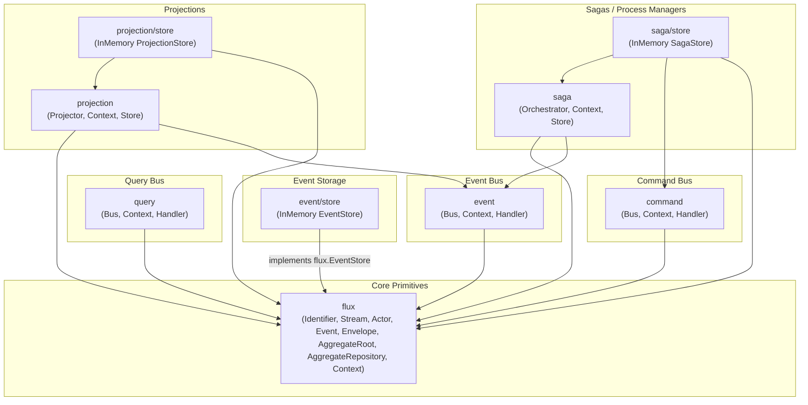

# Architecture, Dependency Graph & Subpackage Reference

This document provides a comprehensive overview of the `flux` framework architecture, including package dependency analysis, proof of acyclic hierarchy, and a complete catalog of all exported structs, interfaces, and functions across subpackages.

---

## 1. Dependency Graph & Cycle Analysis

The framework follows a strict **layered directed acyclic graph (DAG)** architecture. Core domain models and primitives remain self-contained at the root, while messaging buses, projections, and sagas reside in dedicated subpackages that depend unidirectionally on the core.

### Package Hierarchy Overview

```text
                                    ┌───────────────┐
                                    │  flux (core)  │
                                    │  - Primitives │
                                    │  - Context    │
                                    │  - Aggregate  │
                                    │  - Repository │
                                    └───────┬───────┘
          ┌─────────────────────┬───────────┴───────────┬─────────────────────┐
          │                     │                       │                     │
          ▼                     ▼                       ▼                     ▼
  ┌───────────────┐     ┌───────────────┐       ┌───────────────┐     ┌───────────────┐
  │    command    │     │     query     │       │     event     │     │  event/store  │
  │  - Bus        │     │  - Bus        │       │  - Bus        │     │  - InMemory   │
  │  - Context    │     │  - Context    │       │  - Context    │     └───────────────┘
  │  - Handler    │     │  - Handler    │       │  - Handler    │
  └───────┬───────┘     └───────────────┘       └───────┬───────┘
          │                                             │
          │             ┌───────────────────────────────┤
          │             │ (consumes global events)      │ (consumes global events)
          │             ▼                               ▼
          │     ┌───────────────┐               ┌───────────────┐
          │     │  projection   │               │     saga      │
          │     │  - Projector  │               │  - Orchestr.  │
          │     │  - Context    │               │  - Context    │
          │     │  - Store      │               │  - Store      │
          │     └───────┬───────┘               └───────┬───────┘
          │             │                               │
          │             ▼                               │
          │     ┌───────────────┐                       │
          │     │  projection/  │                       │
          │     │     store     │                       │
          │     │  - InMemory   │                       │
          │     └───────────────┘                       │
          │                                             │
          │ (dispatches outbox commands)                ▼
          └─────────────────────────────────────┌───────────────┐
                                                │  saga/store   │
                                                │  - InMemory   │
                                                └───────────────┘
```

### Dependency Flow Diagram



### Dependency Rules & Cycle Prevention

1. **Zero Downward Imports:** The root `flux` package imports **none** of the subpackages (`command`, `query`, `event`, `projection`, `saga`, or any `store`). It can never participate in an import cycle.
2. **Context Extension Hierarchy:**
   - `flux.Context` provides base execution metadata (`Actor`, `CorrelationIdentifier`, `CausationIdentifier`).
   - `command.Context` embeds `flux.Context` and adds `CommandIdentifier()`.
   - `query.Context` embeds `flux.Context` and adds `QueryIdentifier()`.
   - `event.Context` embeds `flux.Context` and adds `EventIdentifier()`, `Stream()`, `Revision()`, `Position()`, `Metadata()`.
   - `projection.Context` embeds `event.Context`.
   - `saga.Context` embeds `event.Context` and adds `QueuedCommands()`.
3. **Saga Outbox Integration:** The `saga/store` driver imports `command.Bus` to dispatch asynchronous outbox commands. Because `command` has no knowledge of `saga`, the dependency remains strictly unidirectional (`saga/store` $\rightarrow$ `command` $\rightarrow$ `flux`).

---

## 2. Subpackages Reference

### Package: `github.com/wotek/flux`
The core module providing foundational primitives, aggregate lifecycle management, and persistence contracts.

#### Structs
* `Identifier`: Compact, zero-allocation Uniform Resource Name (URN) addressing any resource in the format `urn:<org>:<env>:<service>:<account>:<type>:<id>[@version]`.
* `Stream`: Represents an append-only stream of events identified by an `Identifier`.
* `Actor`: Represents the user, system, or service that triggered a state change.
* `Envelope`: Wraps a domain event payload with revision, global position, actor, causation, correlation, and timestamp metadata.
* `Changeset[E Event]`: Tracks uncommitted events generated during aggregate operations.
* `AggregateRoot[E Event]`: Embeddable base for building aggregates with automatic revision tracking, event replaying, and changeset management.
* `AggregateRepository[A Aggregate[A, E], E Event]`: Unit-of-work repository for loading aggregates from an `EventStore` and saving uncommitted events with optimistic concurrency verification.

#### Interfaces
* `Event`: Marker interface implemented by domain events; requires `Name() string`.
* `Aggregate[A, E]`: Go 1.26 self-referencing generic constraint implemented by aggregate roots. Requires `Identifier() Identifier`, `Revision() uint64`, `Changeset() Changeset[E]`, `FromEvents(iter.Seq2[Envelope, error]) error`, and `New(Stream) A`.
* `Changeset[E Event]`: Interface for recording and retrieving uncommitted domain events.
* `EventStore`: Persistence contract defining `Append(ctx, stream, expectedRevision, events)`, `Read(ctx, stream)`, and `Stream(ctx, fromPosition)`.
* `Context`: Base execution context providing `Actor()`, `CorrelationIdentifier()`, and `CausationIdentifier()`.

#### Functions
* `NewIdentifier(org, env, service, account, resourceType, resourceID, version string) Identifier`: Constructs an Identifier.
* `ParseIdentifier(s string) (Identifier, error)`: Parses an RFC-like URN into an `Identifier`.
* `NewIdentifierFromString(s string) Identifier`: Parses an Identifier or panics (ideal for test setups).
* `NewChangeset[E Event]() Changeset[E]`: Constructs an in-memory changeset.
* `NewAggregateRoot[E Event](stream Stream, changeset Changeset[E], apply func(E) error) AggregateRoot[E]`: Constructs an embeddable `AggregateRoot`.
* `NewAggregateRepository[A, E](eventStore EventStore) *AggregateRepository[A, E]`: Creates an `AggregateRepository`.
* `NewContext(parent context.Context, actor Actor, correlationID, causationID Identifier) Context`: Constructs a base `flux.Context`.

---

### Package: `github.com/wotek/flux/command`
Provides in-memory, constant-time `O(1)` routing for CQRS command dispatching.

#### Structs & Types
* `Bus`: Concurrency-safe registry routing commands to single registered handlers.

#### Interfaces
* `Context`: Extends `flux.Context` with `CommandIdentifier() flux.Identifier`.
* `Handler[C any]`: Defines `Handle(ctx Context, cmd C) error` for processing command `C`.

#### Functions
* `New() *Bus` (alias `NewBus()`): Creates a new command bus.
* `NewContext(parent, cmdID, actor, correlationID, causationID) Context`: Creates a command context.
* `Register[C any](bus *Bus, handler func(Context, C) error)`: Registers a closure handler for command type `C`.
* `RegisterHandler[C any](bus *Bus, handler Handler[C])`: Registers an interface handler for command type `C`.
* `Execute[C any](ctx Context, bus *Bus, cmd C) error`: Dispatches command `C` synchronously with `O(1)` performance.
* `ExecuteAsync[C any](ctx Context, bus *Bus, cmd C) error`: Dispatches command `C` in a background goroutine with panic recovery.

---

### Package: `github.com/wotek/flux/query`
Provides type-safe, reflection-free query execution and read-model retrieval.

#### Structs & Types
* `Bus`: Concurrency-safe registry routing queries to their handler.

#### Interfaces
* `Context`: Extends `flux.Context` with `QueryIdentifier() flux.Identifier`.
* `Handler[Q any, R any]`: Defines `Handle(ctx Context, query Q) (R, error)`.

#### Functions
* `New() *Bus` (alias `NewBus()`): Creates a new query bus.
* `NewContext(parent, queryID, actor, correlationID, causationID) Context`: Creates a query context.
* `Register[Q any, R any](bus *Bus, handler func(Context, Q) (R, error))`: Registers a closure handler.
* `RegisterHandler[Q any, R any](bus *Bus, handler Handler[Q, R])`: Registers an interface handler.
* `Execute[Q any, R any](ctx Context, bus *Bus, query Q) (R, error)`: Executes query `Q` and returns read model `R`.

---

### Package: `github.com/wotek/flux/event`
Provides event distribution to multiple subscribers and access to envelope metadata.

#### Structs & Types
* `Bus`: Registry supporting multiple subscriber handlers per domain event name.

#### Interfaces
* `Context`: Extends `flux.Context` with `EventIdentifier()`, `Stream()`, `Revision()`, `Position()`, and `Metadata()`.
* `Handler[E flux.Event]`: Defines `Handle(ctx Context, event E) error`.

#### Functions
* `New() *Bus` (alias `NewBus()`): Creates an event bus.
* `NewContext(parent context.Context, env flux.Envelope) Context`: Creates an event context from an envelope.
* `Register[E flux.Event](bus *Bus, handler func(Context, E) error)`: Subscribes a closure handler.
* `RegisterHandler[E flux.Event](bus *Bus, handler Handler[E])`: Subscribes an interface handler.
* `PublishEnvelope(ctx Context, bus *Bus, env flux.Envelope) error`: Dispatches an envelope to all matching subscribers.
* `Publish[E flux.Event](ctx Context, bus *Bus, event E) error`: Wraps and publishes a bare event.

---

### Package: `github.com/wotek/flux/projection`
Engine for maintaining asynchronous read models and tracking global event stream checkpoints.

#### Structs & Types
* `Projector`: Worker that continuously tails an `EventStore` from the last saved position and executes registered event projection handlers.

#### Interfaces
* `Store`: Persistence contract defining `GetPosition(ctx, id) (uint64, error)` and `Update(ctx, id, env, mutate func(txCtx) error) error`.
* `Context`: Extends `event.Context` inside a transactional projection update boundary.

#### Functions
* `New(id flux.Identifier, eventStore flux.EventStore, projStore Store) *Projector`: Creates a Projector.
* `NewContext(parent event.Context) Context`: Creates a projection context.
* `RegisterHandler[E flux.Event](p *Projector, handler func(Context, E) error)`: Maps a domain event to projection logic.
* `(p *Projector) Start(ctx context.Context) error`: Runs the continuous tailing loop until context cancellation.

---

### Package: `github.com/wotek/flux/saga`
Orchestration engine coordinating long-running business processes and durable Outbox command dispatching.

#### Structs & Types
* `Orchestrator`: Worker routing global events to specific saga instances by correlation ID.

#### Interfaces
* `Saga[S Saga[S]]`: Go 1.26 self-referencing generic constraint requiring `Identifier() flux.Identifier` and `New() S`.
* `Store[S Saga[S]]`: Persistence contract for loading saga state and atomically saving state alongside outbox commands.
* `Context`: Extends `event.Context` with `QueuedCommands() []any`.

#### Functions
* `NewOrchestrator(eventStore flux.EventStore) *Orchestrator`: Creates a Saga Orchestrator.
* `NewContext(parent event.Context) Context`: Creates a saga context.
* `EnqueueCommand[C any](ctx Context, cmd C)`: Safely enqueues a strongly-typed command into the saga outbox.
* `RegisterHandler[S Saga[S], E flux.Event](o *Orchestrator, store Store[S], handler func(Context, S, E) error)`: Links an event to a saga step.
* `(o *Orchestrator) Start(ctx context.Context) error`: Runs the orchestrator polling loop.

---

### Driver Subpackages (`*/store`)
Thread-safe in-memory implementations for testing and development:

* **`github.com/wotek/flux/event/store`**:
  * `EventStore`: In-memory implementation of `flux.EventStore` with optimistic concurrency validation.
  * `New()`: Constructor.
* **`github.com/wotek/flux/projection/store`**:
  * `ProjectionStore`: In-memory implementation of `projection.Store`.
  * `New()`: Constructor.
* **`github.com/wotek/flux/saga/store`**:
  * `SagaStore[S saga.Saga[S]]`: In-memory implementation of `saga.Store` with a background Outbox Relay poller (`StartRelay(ctx)`).
  * `New[S](cmdBus *command.Bus)`: Constructor.
