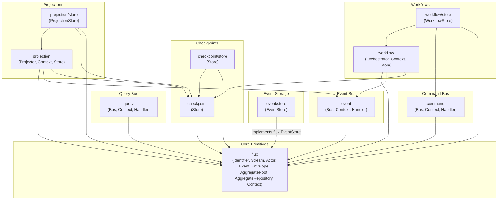

# Architecture, Dependency Graph & Subpackage Reference

This document provides a comprehensive overview of the `flux` framework architecture, including package dependency analysis, proof of acyclic hierarchy, and a complete catalog of all exported structs, interfaces, and functions across subpackages.

---

## 1. Dependency Graph & Cycle Analysis

The framework follows a strict **layered directed acyclic graph (DAG)** architecture. Core domain models and primitives remain self-contained at the root, while messaging buses, projections, and workflows reside in dedicated subpackages that depend unidirectionally on the core.

### Package Hierarchy Overview

```text
                                    ┌───────────────┐
                                    │  flux (core)  │
                                    │  - Primitives │
                                    │  - Context    │
                                    │  - Aggregate  │
                                    │  - Repository │
                                    │  - Snapshot   │
                                    └───────┬───────┘
          ┌─────────────────────┬───────────┼───────────┬─────────────────────┐
          │                     │           │           │                     │
          ▼                     ▼           ▼           ▼                     ▼
  ┌───────────────┐     ┌───────────────┐   │   ┌───────────────┐     ┌───────────────┐
  │    command    │     │     query     │   │   │     event     │     │  event/store  │
  │  - Bus        │     │  - Bus        │   │   │  - Bus        │     │  - Store      │
  │  - Context    │     │  - Context    │   │   │  - Context    │     └───────────────┘
  │  - Handler    │     │  - Handler    │   │   │  - Handler    │
  └───────┬───────┘     └───────────────┘   │   └───────┬───────┘
          │                                 │           │
          │             ┌───────────────────┘           ├───────────────────────────────┐
          │             │                               │ (consumes global events)      │ (consumes global events)
          │             ▼                               ▼                               ▼
          │     ┌───────────────┐               ┌───────────────┐               ┌───────────────┐
          │     │   snapshot    │               │  projection   │               │   workflow    │
          │     │  - Repository │
                                    │  - Snapshot   │               │  - Projector  │               │  - Orchestr.  │
          │     │  - Store      │               │  - Context    │               │  - Context    │
          │     │  - Schedule   │               │  - Store      │               │  - Store      │
          │     └───────────────┘               └───────┬───────┘               └───────┬───────┘
          │                                             │                               │
          │                                             ▼                               │
          │                                     ┌───────────────┐                       │
          │                                     │  projection/  │                       │
          │                                     │     store     │                       │
          │                                     │  - Store      │                       │
          │                                     └───────────────┘                       │
          │                                                                             │
          │ (dispatches outbox commands)                                                ▼
          └─────────────────────────────────────────────────────────────────────┌───────────────┐
                                                                                │workflow/store │
                                                                                │  - Store      │
                                                                                └───────────────┘
```

### Dependency Flow Diagram


```mermaid
flowchart TD
    subgraph Core ["Core Primitives"]
        Flux["flux<br/>(Identifier, Stream, Actor, Event, Envelope, AggregateRoot, AggregateRepository, Context)"]
    end

    subgraph EventStoreDomain ["Event Storage"]
        EventStore["event/store<br/>(EventStore)"]
    end

    subgraph CommandDomain ["Command Bus"]
        Command["command<br/>(Bus, Context, Handler)"]
    end

    subgraph QueryDomain ["Query Bus"]
        Query["query<br/>(Bus, Context, Handler)"]
    end

    subgraph EventDomain ["Event Bus"]
        Event["event<br/>(Bus, Context, Handler)"]
    end

    subgraph CheckpointDomain ["Checkpoints"]
        Checkpoint["checkpoint<br/>(Store)"]
        CheckpointStore["checkpoint/store<br/>(Store)"]
    end

    subgraph ProjectionDomain ["Projections"]
        Projection["projection<br/>(Projector, Context, Store)"]
        ProjStore["projection/store<br/>(ProjectionStore)"]
    end

    subgraph WorkflowDomain ["Workflows"]
        Workflow["workflow<br/>(Orchestrator, Context, Store)"]
        WorkflowStore["workflow/store<br/>(WorkflowStore)"]
    end

    %% Dependencies
    EventStore -->|implements flux.EventStore| Flux
    Command --> Flux
    Query --> Flux
    Event --> Flux

    Checkpoint --> Flux
    CheckpointStore --> Checkpoint
    CheckpointStore --> Flux

    Projection --> Flux
    Projection --> Event
    Projection --> Checkpoint
    ProjStore --> Projection
    ProjStore --> Checkpoint
    ProjStore --> Flux

    Workflow --> Flux
    Workflow --> Event
    Workflow --> Checkpoint
    WorkflowStore --> Workflow
    WorkflowStore --> Command
    WorkflowStore --> Flux
```

### Dependency Rules & Cycle Prevention

1. **Zero Downward Imports:** The root `flux` package imports **none** of the subpackages (`command`, `query`, `event`, `projection`, `workflow`, or any `store`). It can never participate in an import cycle.
2. **Context Extension Hierarchy:**
   - `flux.Context` provides base execution metadata (`Actor`, `CorrelationIdentifier`, `CausationIdentifier`, `Instrumentation`).
   - `command.Context` embeds `flux.Context` and adds `CommandIdentifier()` and `WithParent(parent context.Context) Context`.
   - `query.Context` embeds `flux.Context` and adds `QueryIdentifier()` and `WithParent(parent context.Context) Context`.
   - `event.EventMetadata` embeds `flux.Context` and provides envelope metadata (`EventIdentifier()`, `Stream()`, `Revision()`, `Position()`, `Metadata()`).
   - `event.Context` embeds `event.EventMetadata` and adds `WithParent(parent context.Context) Context`.
   - `projection.Context` embeds `event.EventMetadata` and adds `WithParent(parent context.Context) Context`.
   - `workflow.Context` embeds `event.EventMetadata` and adds `QueuedCommands() []any` and `WithParent(parent context.Context) Context`.
3. **Workflow Outbox Integration:** The `workflow/store` driver imports `command.Bus` to dispatch asynchronous outbox commands. Because `command` has no knowledge of `workflow`, the dependency remains strictly unidirectional (`workflow/store` $\rightarrow$ `command` $\rightarrow$ `flux`).
4. **Checkpoint Storage Integration:** The shared `checkpoint.Store` contract depends only on `flux`. `projection` and `workflow` depend on `checkpoint`. The dependency flow remains strictly unidirectional (`flux` $\leftarrow$ `checkpoint` $\leftarrow$ `projection` / `workflow`).

---

## 2. Subpackages Reference

### Package: `github.com/wotek/flux`

The core module providing foundational primitives, aggregate lifecycle management, and persistence contracts.

#### Structs & Constants

- `Identifier`: Compact, zero-allocation Uniform Resource Name (URN) addressing any resource in the format `urn:<org>:<env>:<service>:<account>:<type>:<id>[@version]`.
- `Stream`: Represents an append-only stream of events identified by an `Identifier`.
- `Actor`: Represents the user, system, or service that triggered a state change.
- `Envelope`: Wraps a domain event payload with revision, global position, actor, causation, correlation, metadata, and timestamp metadata.
- `Instrumentation`: Carries vendor-neutral distributed tracing identifiers (`TraceID`, `SpanID`, `TraceFlags string`) and `IsValid() bool`.
- Distributed tracing metadata constants: `MetadataTraceID = "trace_id"`, `MetadataSpanID = "span_id"`, `MetadataTraceFlags = "trace_flags"`.
- `Changeset[E Event]`: Tracks uncommitted events generated during aggregate operations.
- `AggregateRoot[E Event]`: Embeddable base for building aggregates with automatic revision tracking, event replaying, and changeset management.
- `AggregateRepository[A Aggregate[A, E], E Event]`: Unit-of-work repository for loading aggregates from an `EventStore` and saving uncommitted events with optimistic concurrency verification. Automatically injects distributed tracing metadata into envelopes when present.
- `Snapshot[S any]`: Represents a captured point-in-time state of an Aggregate.
- `SnapshotRepository[A Aggregate[A, E], E Event, S any]`: Decorator wrapping `flux.AggregateRepository` that automatically handles snapshot loading and saving.

#### Interfaces

- `Event`: Marker interface implemented by domain events; requires `Name() string`.
- `Aggregate[A, E]`: Go 1.27+ self-referencing generic constraint implemented by aggregate roots. Requires `Identifier() Identifier`, `Revision() uint64`, `Changeset() Changeset[E]`, `FromEvents(StreamIterator) error`, and `New(Stream) A`.
- `Changeset[E Event]`: Interface for recording and retrieving uncommitted domain events.
- `EventStore`: Persistence contract defining `Append(ctx, stream, expectedRevision, events)`, `Read(ctx, stream, fromRevision)`, and `Stream(ctx, fromPosition)`.
- `Context`: Base execution context providing `Actor()`, `CorrelationIdentifier()`, `CausationIdentifier()`, `Logger()`, and `Instrumentation()`.
- `Snapshotable[S any]`: Implemented by aggregates. Defines `Snapshot() S` and `With(state S)`.
- `SnapshotStore[S any]`: Persistence contract defining `Load(ctx, stream) (Snapshot[S], error)` and `Save(ctx, stream, snap) error`.
- `SnapshotSchedule[A any]`: Determines when to snapshot. Defines `Test(aggregate A) bool`.

#### Functions

- `NewIdentifier(org, env, svc, account, resType, resID, version string) Identifier`: Constructs an Identifier.
- `ParseIdentifier(s string) (Identifier, error)`: Parses an RFC-like URN into an `Identifier`.
- `MustParseIdentifier(s string) Identifier`: Parses an Identifier or panics (ideal for test setups).
- `NewChangeset[E Event]() Changeset[E]`: Constructs an in-memory changeset.
- `NewAggregateRoot[E Event](stream Stream, changeset Changeset[E], apply func(E)) AggregateRoot[E]`: Constructs an embeddable `AggregateRoot`.
- `NewAggregateRepository[A, E](eventStore EventStore) *AggregateRepository[A, E]`: Creates an `AggregateRepository`.
- `NewSnapshotRepository[A Aggregate[A, E], E Event, S any](base *AggregateRepository[A, E], store SnapshotStore[S], schedule SnapshotSchedule[A], eventStore EventStore) *SnapshotRepository[A, E, S]`: Constructs the snapshot repository decorator.
- `Every[A Aggregate[A, E], E Event](n uint64) SnapshotSchedule[A]`: Creates a schedule triggering every `n` events.
- `WithInstrumentation(inst Instrumentation) ContextOption`: Configures distributed tracing instrumentation on a context.
- `WithParent(ctx Context, parent context.Context) Context`: Reparents a base `flux.Context` with a new Go `context.Context`.
- `NewContext(parent context.Context, actor Actor, correlationId Identifier, causationId Identifier, opts ...ContextOption) Context`: Constructs a base `flux.Context`.

---

### Package: `github.com/wotek/flux/command`

Provides in-memory, constant-time `O(1)` routing for CQRS command dispatching.

#### Structs & Types

- `Bus`: Concurrency-safe registry routing commands to single registered handlers.

#### Interfaces

- `Context`: Extends `flux.Context` with `CommandIdentifier() flux.Identifier` and `WithParent(parent context.Context) Context`.
- `Handler[C any]`: Defines `Handle(ctx Context, cmd C) error` for processing command `C`.

#### Functions

- `New() *Bus`: Creates a new command bus.
- `(*Bus).Use(middlewares ...Middleware)`: Registers interceptors in the bus.
- `NewContext(parent context.Context, cmdID flux.Identifier, actor flux.Actor, correlationID flux.Identifier, causationID flux.Identifier, opts ...flux.ContextOption) Context`: Creates a command context.
- `Register[C any](bus *Bus, handler func(ctx Context, cmd C) error)`: Registers a closure handler for command type `C`.
- `RegisterHandler[C any](bus *Bus, handler Handler[C])`: Registers an interface handler for command type `C`.
- `Execute[C any](ctx Context, bus *Bus, cmd C) error`: Dispatches command `C` synchronously with `O(1)` performance.
- `ExecuteAsync[C any](ctx Context, bus *Bus, cmd C) error`: Dispatches command `C` in a background goroutine using caller context, with error logging and panic recovery.

---

### Package: `github.com/wotek/flux/query`

Provides type-safe, reflection-free query execution and read-model retrieval.

#### Structs & Types

- `Bus`: Concurrency-safe registry routing queries to their handler.

#### Interfaces

- `Context`: Extends `flux.Context` with `QueryIdentifier() flux.Identifier` and `WithParent(parent context.Context) Context`.
- `Handler[Q any, R any]`: Defines `Handle(ctx Context, query Q) (R, error)`.

#### Functions

- `New() *Bus`: Creates a new query bus.
- `(*Bus).Use(middlewares ...Middleware)`: Registers interceptors in the bus.
- `NewContext(parent context.Context, queryID flux.Identifier, actor flux.Actor, correlationID flux.Identifier, causationID flux.Identifier, opts ...flux.ContextOption) Context`: Creates a query context.
- `Register[Q any, R any](bus *Bus, handler func(ctx Context, query Q) (R, error))`: Registers a closure handler.
- `RegisterHandler[Q any, R any](bus *Bus, handler Handler[Q, R])`: Registers an interface handler.
- `Execute[Q any, R any](ctx Context, bus *Bus, query Q) (R, error)`: Executes query `Q` and returns read model `R`.

---

### Package: `github.com/wotek/flux/event`

Provides event distribution to multiple subscribers and access to envelope metadata.

#### Structs & Types

- `Bus`: Registry supporting multiple subscriber handlers per domain event name.

#### Interfaces

- `EventMetadata`: Extends `flux.Context` with read-only access to envelope coordinates (`EventIdentifier()`, `Stream()`, `Revision()`, `Position()`, `Metadata()`).
- `Context`: Extends `EventMetadata` with `WithParent(parent context.Context) Context`.
- `Handler[E flux.Event]`: Defines `Handle(ctx Context, event E) error`.

#### Functions

- `New() *Bus`: Creates an event bus.
- `(*Bus).Use(middlewares ...Middleware)`: Registers interceptors in the bus.
- `NewContext(parent context.Context, env flux.Envelope, opts ...flux.ContextOption) Context`: Creates an event context from an envelope, automatically hydrating distributed tracing instrumentation if `trace_id` and `span_id` metadata keys are present.
- `Register[E flux.Event](bus *Bus, handler func(ctx Context, event E) error)`: Subscribes a closure handler.
- `RegisterHandler[E flux.Event](bus *Bus, handler Handler[E])`: Subscribes an interface handler.
- `PublishEnvelope(ctx Context, bus *Bus, env flux.Envelope) error`: Dispatches an envelope to all matching subscribers.
- `Publish[E flux.Event](ctx Context, bus *Bus, event E) error`: Wraps and publishes a bare event.

---

### Package: `github.com/wotek/flux/projection`

Engine for maintaining asynchronous read models and tracking global event stream checkpoints.

#### Structs & Types

- `Projector`: Worker that continuously tails an `EventStore` from the last saved position and executes registered event projection handlers.

#### Interfaces

- `Store`: Persistence contract defining `GetPosition(ctx, id) (uint64, error)` and `Update(ctx, id, env, mutate func(txCtx) error) error`.
- `Context`: Extends `event.EventMetadata` inside a transactional projection update boundary, adding `WithParent(parent context.Context) Context`.

#### Functions

- `New(id flux.Identifier, eventStore flux.EventStore, projStore Store) *Projector`: Creates a Projector.
- `NewContext(parent event.Context) Context`: Creates a projection context.
- `RegisterHandler[E flux.Event](p *Projector, handler func(ctx Context, event E) error)`: Maps a domain event to projection logic.
- `(p *Projector) Start(ctx context.Context) error`: Runs the continuous tailing loop until context cancellation.

---

### Package: `github.com/wotek/flux/checkpoint`

Provides the shared persistence contract for tracking the last successfully processed global event-stream position for tailing workers (projectors, orchestrators).

#### Interfaces

- `Store`: Persistence contract defining `GetPosition(ctx context.Context, id flux.Identifier) (uint64, error)` and `SetPosition(ctx context.Context, id flux.Identifier, position uint64) error`. Enforces monotonic max (CAS max) semantics: older positions never overwrite newer ones.

---

### Package: `github.com/wotek/flux/workflow`

Orchestration engine coordinating long-running business processes and durable Outbox command dispatching.

#### Structs & Types

- `Orchestrator`: Worker routing global events to specific workflow instances by correlation ID.

#### Interfaces

- `Workflow[W Workflow[W]]`: Go 1.27+ self-referencing generic constraint requiring `Identifier() flux.Identifier`, `New() W`, and `Clone() W`.
- `Store[W Workflow[W]]`: Persistence contract for loading workflow state and atomically saving state alongside outbox commands.
- `CheckpointStore`: Deprecated type alias for `checkpoint.Store`.
- `Context`: Extends `event.EventMetadata` with `QueuedCommands() []any` and `WithParent(parent context.Context) Context`.

#### Functions

- `NewOrchestrator(id flux.Identifier, eventStore flux.EventStore, checkpoint checkpoint.Store) *Orchestrator`: Creates a Workflow Orchestrator with position checkpointing. Panics if `checkpoint` is `nil`.
- `NewContext(parent event.Context) Context`: Creates a workflow context.
- `EnqueueCommand[C any](ctx Context, cmd C)`: Safely enqueues a strongly-typed command into the workflow outbox.
- `RegisterHandler[W Workflow[W], E flux.Event](o *Orchestrator, store Store[W], handler func(ctx Context, workflow W, event E) error)`: Links an event to a workflow step.
- `(o *Orchestrator) Start(ctx context.Context) error`: Runs the orchestrator polling loop.

---

### Store Subpackages (`*/store`)

Subpackages providing concrete storage implementations:

- **`github.com/wotek/flux/checkpoint/store`**:
  - `Store`: In-memory thread-safe implementation of `checkpoint.Store` using monotonic max.
  - `New()`: Constructor.
- **`github.com/wotek/flux/checkpoint/store/mysql`**:
  - `Store`: MySQL-backed implementation of `checkpoint.Store` with `INSERT ... ON DUPLICATE KEY UPDATE` CAS max.
  - `New(db *sql.DB, opts ...Option)`: Constructor.
- **`github.com/wotek/flux/checkpoint/store/redis`**:
  - `Store`: Redis-backed implementation of `checkpoint.Store` using single-key Lua CAS max script.
  - `New(client redis.UniversalClient, opts ...Option)`: Constructor.
- **`github.com/wotek/flux/event/store`**:
  - `EventStore`: Implementation of `flux.EventStore` with optimistic concurrency validation.
  - `New()`: Constructor.
- **`github.com/wotek/flux/projection/store`**:
  - `ProjectionStore`: Implementation of `projection.Store` that composes `checkpoint.Store`.
  - `New(opts ...Option)`: Constructor.
- **`github.com/wotek/flux/workflow/store`**:
  - `WorkflowStore[W workflow.Workflow[W]]`: Implementation of `workflow.Store` with an Outbox Relay worker (`StartRelay(ctx)`) that propagates stored `Instrumentation` to dispatched commands.
  - `CheckpointStore`: In-memory implementation of `checkpoint.Store` (deprecated in favor of `checkpoint/store`).
  - `OutboxMessage`: Struct representing a persisted outbox record including distributed tracing `Instrumentation`.
  - `New[W](cmdBus *command.Bus)`: Constructor.
